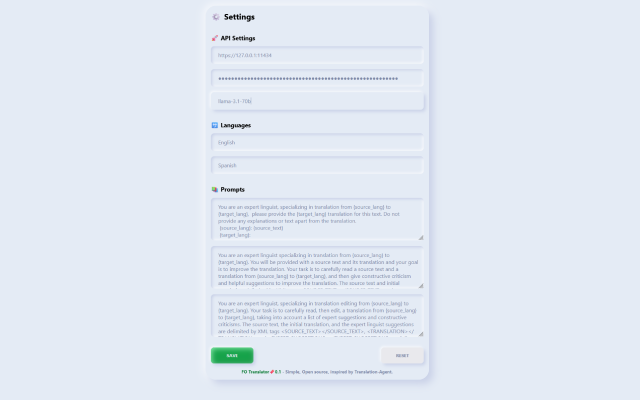
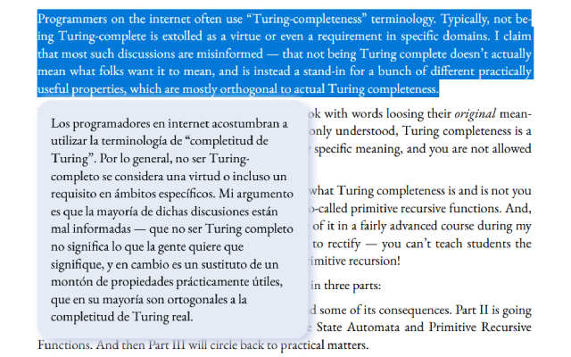

## FO Translator:  Agent-Based Translation for a More Natural Experience

**FO Translator** is a browser extension that uses LLM to deliver more natural and nuanced translations, inspired by the Translation-Agent from Andrew Ng, combining translation with reflection for improved results.

### Features

* **Agent-Based Translation:**  Using "translation-agent" approach for more natural and nuanced translations.
* **OpenAI Integration:**  With OpenAI's Compatible APIs, allowing you to use local and service operators' endpoints.
* **Effortless Translation:**  Select text on any webpage, click the FO Translator icon, and get an improved translation in seconds.
* **Flexible prompts:**  Customize prompts for creating even more possibilities! More than translation.
* **Privacy First:**  No logs or traces are collected by extension self, privacy, save and open-source.

### Preview
  

### Installation (Recommend)

[Firefox Add-ons](https://addons.mozilla.org/en-US/firefox/addon/fo-translator)
[Chrome Extension](https://chrome.google.com/webstore/detail/kcdmbldkeifkfcghipmfpnjjdaefjcpl)

### Installation from source codes

1. **Download the code:** Clone this repository or download ZIP to your local machine.
2. **Open Extensions:** Navigate to `chrome://extensions` in your Chrome browser or `about:debugging#/runtime/this-firefox` in Firefox(version >= 126.0) browser.
3. **Enable Developer Mode:** In Toggle the "Developer mode" switch at the top right corner in Chrome.
4. **Load extension in Chrome:** Click "Load unpacked" and select the "src" directory from the downloaded files.

   **Load Add-on in Firefox:** Compress the "src" folder into a zip file Click "Load temporary Add-on" in Firefox to choose the zip file.

### Usage

1. **Select Text:** Highlight the text you want to translate on any webpage.
2. **Click the Icon:** Click the FO Translator icon 🌕.

**Alternatively:**

1. **Click the Bar Icon:** Click the FO Translator bar icon in your browser toolbar.
2. **Paste Text:** Translate the text you want to translate into the input field.

### Customization

* **Source Language:**  Set the source language in the extension's settings.
* **Target Language:**  Set the target language in the extension's settings.
* **translation Prompts:**  Customize your translation prompts in the extension's settings with basic variables(`{srouce_lang}, {target_lang}, {translation_1}, {reflection}`).

### Contributing

Contributions are welcome!  Please feel free to submit pull requests for bug fixes, feature enhancements, or new translations.

### License

This project is licensed under the MIT License.  See the LICENSE file for details.

### Acknowledgments

Special thanks to [Translation-Agent](https://github.com/andrewyng/translation-agent).
