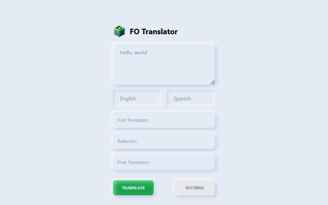

## FO Translator:  Agent-Based Translation for a More Natural Experience

**FO Translator** is a Chrome extension that uses cutting-edge AI technology to deliver more natural and nuanced translations.  It leverages the "translation-agent: Agentic translation using reflection workflow" by Andrew Ng, combining translation with reflection for improved results.

### Features

* **Agent-Based Translation:**  Utilizes Andrew Ng's "translation-agent" approach for more natural and nuanced translations.
* **OpenAI Integration:**  Compatible with OpenAI's powerful APIs, allowing you to customize prompts for even more precise translations.
* **Effortless Translation:**  Select text on any webpage, click the FO Translator icon, and get an improved translation in seconds.
* **Flexible Input:**  Paste text directly into the FO Translator bar icon for instant translation.
* **Privacy First:**  No logs are collected, and the extension is completely safe and open-source.

### Preview
  

### Installation

1. **Download the code:** Clone this repository to your local machine.
2. **Open Chrome Extensions:** Navigate to `chrome://extensions` in your Chrome browser.
3. **Enable Developer Mode:** Toggle the "Developer mode" switch at the top right corner.
4. **Load Unpacked:** Click "Load unpacked" and select the directory containing the downloaded code.

### Usage

1. **Select Text:** Highlight the text you want to translate on any webpage.
2. **Click the Icon:** Click the FO Translator icon in your browser toolbar.
3. **View Translation:** The translated text will appear in a pop-up window.

**Alternatively:**

1. **Click the Bar Icon:** Click the FO Translator bar icon in your browser toolbar.
2. **Paste Text:** Paste the text you want to translate into the input field.
3. **View Translation:** The translated text will appear in the input field.

### Customization

* **Source Language:**  Set the source language in the extension's settings.
* **Target Language:**  Set the target language in the extension's settings.
* **translation Prompts:**  Customize your translation prompts in the extension's settings for more precise translations.

### Contributing

Contributions are welcome!  Please feel free to submit pull requests for bug fixes, feature enhancements, or new translations.

### License

This project is licensed under the MIT License.  See the LICENSE file for details.

### Acknowledgments

Special thanks to [Translation-Agent](https://github.com/andrewyng/translation-agent).
